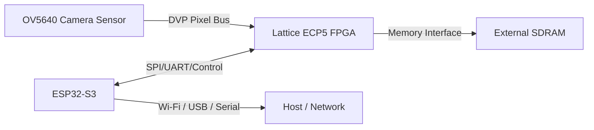

# AiCamera — AI FPGA Camera Board (HW Rev 1.0)

I’m building a compact embedded-vision platform around a **Lattice ECP5 FPGA + OV5640 camera + ESP32‑S3 + external SDRAM**, with a heavy focus on **real PCB engineering**: power integrity, EMI reduction, signal integrity, and manufacturability.

✅ **HW Rev:** **1.0 (ordered)**  
🛠️ **Right now I’m working on:** finishing the FPGA + ESP32 code, then bringing the board up when the hardware arrives. (Week of March 16?)

---

## Why I’m building this

I wanted something more than “connect modules and hope.” This is a full-stack board where my hardware decisions are intentional:

- Capture camera frames reliably with deterministic timing
- Run low-latency image processing on the FPGA
- Use the ESP32‑S3 for configuration, control, and comms (Wi‑Fi / USB / etc.)
- Use SDRAM for buffering and future heavier pipelines
- Iterate using **SIwave + Ansys workflows + IBIS** instead of guessing

---

## High-level architecture

**OV5640 (DVP camera)** → **FPGA (ECP5)** → **SDRAM buffer / processing**  
The ESP32‑S3 handles configuration + control + data transport (depending on firmware).



---

## Design choices I made (and why)

### 1) I went with a parallel camera bus (OV5640 DVP) instead of MIPI
- DVP is **much easier to route and debug** on a custom PCB than MIPI
- Deterministic clock/data alignment is great for FPGA bring-up
- I can validate the full pipeline sooner (test patterns → real frames)

### 2) I put an ESP32‑S3 on the board
- It handles “system glue” tasks: sensor setup (I²C), board control, telemetry, streaming
- It keeps networking + non-deterministic tasks off the FPGA
- It makes the board usable standalone (no special host adapter just to start testing)

### 3) I included SDRAM
- It enables buffering (frame store / line buffers / scratch space for pipelines)
- It gives the FPGA headroom beyond internal BRAM
- It makes future algorithms possible (temporal filters, feature maps, etc.)

### 4) I iterated the PCB with SI/PI/EMI first (not vibes-based layout)
I ran a **simulate → fix → re-layout** loop:
- **SIwave near-field EMI** to find hotspots and drive layout changes
- **Power integrity (DC IR)** awareness (planes/returns/decoupling strategy)
- **IBIS updates** for more realistic edge behavior where possible

A few concrete changes I made during iteration:
- I **moved CCLK** (routing/return/EMI-driven change)
- I **updated IBIS for the FPGA**
- I **added series resistors to the ESP32 SPI lines** to tame edges / reduce ringing

### 5) I treated return paths and EMI control like first-class requirements
- I kept return paths short with continuous reference planes where possible
- I used ground stitching / “fencing” ideas to reduce fringing fields and edge radiation
- I applied routing discipline around clocks and high-activity signals to avoid accidental antennas

My goal wasn’t “perfect RF design” — it was measurable hotspot reduction and a board that behaves consistently.

---

## Repo structure


```

├── ESP32/
│   └── main/                 # ESP32-S3 firmware (control/comms)
├── Lattice Diamond/          # FPGA project(s) / synthesis & constraints workflow
├── PCB/
│   ├── Ai-Camera_backup/     # backups / older PCB states
│   ├── Datasheets/           # component datasheets
│   ├── altium/               # Altium PCB project files
│   └── Ai-Camera.eprj        # PCB project file
├── ansys/
│   └── 02-06/                # SIwave setups (IBIS, Layer Stackup, Components, etc.)
├── .gitattributes
├── .gitignore
└── README.md
```

---

## Current status

### Hardware
- **Rev 1.0 PCB:** ✅ ordered  
- Next: inspection + bring-up + validation

### Firmware / FPGA (active TODOs)
- [ ] Finish FPGA design (capture + buffering + pipeline)
- [ ] Finish ESP32‑S3 firmware (config + control + comms)
- [ ] Bring-up and validation once parts arrive (power → clocks → config → camera → SDRAM)

---

## Bring-up plan (when Rev 1.0 arrives)

1. **Power rails**
   - Verify each rail at test points
   - Confirm no brownouts during FPGA configuration
2. **FPGA configuration**
   - Verify JTAG/config path
3. **ESP32 ↔ FPGA link**
   - SPI/UART sanity + stable edges (series R should help)
4. **OV5640 bring-up**
   - I²C register reads/writes
   - Validate PCLK/VSYNC/HSYNC + data toggling
   - Start with sensor test pattern → then real frames
5. **SDRAM**
   - Memory test (walking patterns / burst tests)
   - Integrate frame buffering
6. **Camera → FPGA → SD CARD/ESP32**
   - Get Cameara footage on SD Card or ESP32 to WIFI 
---

## Roadmap

- [ ] First frame captured (test pattern)
- [ ] First real image capture
- [ ] SDRAM verified under sustained load
- [ ] First FPGA pipeline demo (grayscale / downscale / edge detect)
- [ ] Stream results via ESP32 (Wi‑Fi/USB/serial)
- [ ] Document Rev 1.0 bring-up notes + known issues
---

## Notes

I keep **hardware evidence** (SIwave/Ansys iterations, IBIS-driven tweaks, routing changes) on GitHub commits, so the project history shows *why* each decision was made — not just the final files.
