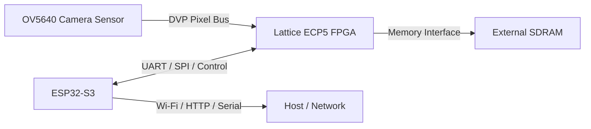

# AiCamera
## AI FPGA Camera Board (HW Rev 1.0)

AiCamera is a custom embedded-vision platform built around a **Lattice ECP5 FPGA**, an **OV5640 camera**, an **ESP32-S3**, and **external SDRAM**. The goal is to build a board that can do more than simply capture frames. I want a platform that can reliably ingest camera data, run a reduced FPGA-friendly vision pipeline, log useful metadata, and expose a practical control path over Wi-Fi through the ESP32-S3.

This repo contains the actual working project, not just a polished snapshot. That means it includes the board design files, FPGA RTL, Lattice Diamond project files, ESP-IDF firmware, simulation artifacts, and bring-up-oriented support files.

---

## Project status

- **Hardware revision:** Rev 1.0
- **PCB status:** ordered
- **Current focus:** FPGA RTL completion, ESP32-S3 firmware validation, and bring-up planning
- **Known status right now:** the ESP32 starter firmware builds, while full end-to-end Python-based host validation still needs to be finished separately

---

## Why this project exists

I wanted something more serious than wiring modules together and hoping they behave. AiCamera is meant to be a full-stack hardware project where the engineering decisions are intentional.

What I want from the board:

- reliable camera bring-up and frame ingest
- deterministic FPGA-side data flow
- off-chip buffering through SDRAM
- a reduced, realistic on-board detection/counting path
- practical wireless control and status via ESP32-S3
- hardware decisions backed by simulation and measurement, not guesses

This project is also a way to practice the parts of hardware work that simpler projects usually skip:
- return-path planning
- EMI awareness
- memory-interface integration
- fit-driven FPGA architecture decisions
- staged bring-up
- tooling and documentation that actually help debug a real board

---

## High-level architecture

**OV5640 (DVP camera)** → **Lattice ECP5 FPGA** → **SDRAM / processing / logging**  
**ESP32-S3** ↔ **FPGA** for control, mode switching, and remote access



---

## Main design decisions

### 1. DVP instead of MIPI
I chose the OV5640 in **parallel DVP mode** instead of trying to start with MIPI CSI.

Why:
- DVP is far easier to route and debug on a custom board
- clock/data relationships are more deterministic
- logic-analyzer and probe-based bring-up is easier
- the FPGA-side capture logic is much simpler
- first-frame bring-up is faster and lower risk

This is a bring-up-first decision, not a claim that MIPI is worse in general.

### 2. ESP32-S3 on the board
The ESP32-S3 is there so the platform has a real controller and communication processor.

What it is used for:
- Wi-Fi access
- board control
- mode switching
- command transport to the FPGA
- future telemetry / remote operation

Why it matters:
- keeps networking and software-heavy tasks off the FPGA
- gives the board a better bring-up and debug story
- makes the project usable without always relying on a raw UART cable to the FPGA

### 3. External SDRAM
On-chip BRAM is too limited for the type of pipeline I want to explore.

Why SDRAM is included:
- frame buffering
- line buffering
- scratch space for reduced image pipelines
- future room for more advanced stages
- cleaner separation between ingest and later processing

### 4. Simulation-backed board iteration
I did not want the PCB layout process to be vibes-based. I wanted layout changes to be connected to actual reasoning.

The repo includes Ansys / SIwave-related assets because I used them to iterate on:
- near-field EMI hotspots
- power integrity awareness
- return-path effects
- IBIS-informed signal behavior where possible

Examples of changes driven by that process:
- moving CCLK
- updating FPGA-related IBIS usage
- adding series resistors on ESP32-side SPI lines
- improving return-path and edge-radiation behavior

### 5. Fit-first FPGA architecture
The target FPGA is not huge, and the current design already pushes utilization hard. That means not every “nice” feature belongs in the top-level build.

That is why the current direction is:
- proposal-first detection
- smaller control path
- limited telemetry in the current fit-constrained design
- bringing up stable reduced functionality before adding more logic

---

## What is actually in this repo

```text
AiCamera/
├── Docs/                     # project documentation
├── ESP32/                    # ESP-IDF firmware project
├── Lattice Diamond/          # FPGA RTL + Diamond project files + build outputs
├── PCB/                      # PCB design files, backups, datasheets
├── ansys/                    # SIwave / Ansys-related files
├── obj_dir/                  # Verilator build output currently in repo
├── .vscode/                  # editor settings
├── README.md
├── LICENSE
├── .gitignore
└── .gitattributes
```

### Important note about the current repo state
This repository currently includes generated/build artifacts such as:
- `ESP32/build/`
- `Lattice Diamond/impl1/`
- `obj_dir/`

Those are useful for local development history, but they are not the cleanest long-term repo shape. They are documented here because they are actually present in the uploaded project right now.

---

## Current firmware / FPGA split

### FPGA
The FPGA owns the deterministic, timing-sensitive path:
- camera init support
- frame ingest
- SDRAM buffering
- proposal generation
- crop generation
- lightweight classifier scheduling
- candidate tracking and counting
- logging / frame packing
- command parsing and control registers

### ESP32-S3
The ESP32 owns the control and connectivity side:
- Wi-Fi station mode
- HTTP API
- command packet generation
- UART forwarding to FPGA

That split is intentional:
- **FPGA = real-time datapath**
- **ESP32 = control and access layer**

---

## Current top-level modes

### Record mode
Used to validate image capture and logging.

Typical goal:
- ingest camera data
- move it into SDRAM
- package/log the frame stream and metadata

### Detect mode
Used to validate the reduced FPGA-side vision flow.

Typical goal:
- generate coarse proposals
- crop candidate windows
- run a lightweight classifier path
- update candidate state
- count people / events

This design is intentionally **proposal-first** and **fit-first**. It is not trying to run a large workstation-style detector unchanged.

---

## Installation and setup

## 1. Clone the repo

```bash
git clone <your-repo-url>
cd AiCamera
```

---

## 2. FPGA tools

### Install Lattice Diamond
Install **Lattice Diamond 3.14** or the version you are already using for this project.

Current project files are under:

```text
Lattice Diamond/
```

Main project files include:
- `AICAM.ldf`
- `AICAM.lpf`
- `timing.sdc`
- `fpga_top.v`

### Open the FPGA project
Open:

```text
Lattice Diamond/AICAM.ldf
```

### Typical FPGA workflow
1. edit RTL
2. run synthesis
3. check area and timing
4. run place and route
5. inspect reports in `Lattice Diamond/impl1/`

---

## 3. ESP32 tools

### Install ESP-IDF
Install **ESP-IDF** for ESP32 development.

Once ESP-IDF is installed and exported in your shell, build from:

```bash
cd ESP32
idf.py set-target esp32s3
idf.py build
idf.py flash
idf.py monitor
```

### Wi-Fi credentials
The firmware currently uses:

```text
ESP32/main/wifi_profile.h
```

A template is also present:

```text
ESP32/main/wifi_profile.h.example
```

Fill in the credential file for your network before flashing.

### Current ESP32 UART settings
The current firmware uses:
- `UART_NUM_1`
- TX pin `17`
- RX pin `18`
- baud `115200`

Those values are hard-coded in `ESP32/main/main.c` right now.

---

## 4. Verilator

Verilator is useful here for removing logic uncertainty before hardware bring-up.

Typical Linux / WSL install:

```bash
sudo apt update
sudo apt install verilator gtkwave build-essential
```

Recommended modules to simulate first:
- `uart_tx.v`
- `uart_rx.v`
- `uart_loopback.v`
- `ov5640_sccb.v`
- `raw_frame_capture.v`
- current UART control blocks

A general build pattern is:

```bash
verilator -Wall --Wno-fatal --trace --timing \
  --cc "Lattice Diamond/<module>.v" \
  --top-module <module_name> \
  --exe sim/tb/<testbench>.cpp \
  --build -o sim_<module_name>
```

Then run:

```bash
./obj_dir/sim_<module_name>
```

Use GTKWave for VCDs:

```bash
gtkwave <waveform>.vcd
```

---

## 5. Python tooling

This uploaded repo does **not currently contain a checked-in `tools/` directory** with the Python host scripts, so the docs describe the expected host workflow but do not claim those files are already present here.

The intended host-side scripts are for:
- sending HTTP commands to the ESP32
- sending raw UART command packets directly to the FPGA
- rendering FPGA detections / counts on top of saved video

Since those scripts are still being validated, this README treats them as part of the planned/active tooling workflow rather than pretending they are already fully landed in this repo.

---

## How to use the current control path

The current control path is:

**Host** → **ESP32 HTTP endpoint** → **ESP32 UART packet** → **FPGA command parser**

### Current ESP32 HTTP endpoints
Defined in `ESP32/main/main.c`:

- `/ping`
- `/status`
- `/capture?enable=1`
- `/mode?value=0`
- `/stride?value=1`

### What those endpoints do
- `/ping` returns a simple `"ok"`
- `/status` sends a `GET_STATUS` command packet to the FPGA
- `/capture` sends `SET_CAPTURE`
- `/mode` sends `SET_MODE`
- `/stride` sends `SET_STRIDE`

### Current command packet format
Generated by `ESP32/main/cmd_protocol.c` and parsed by `Lattice Diamond/fpga_uart_cmd_parser.v`.

Packet bytes:
```text
[0] sync      = 0xA5
[1] opcode
[2] arg[7:0]
[3] arg[15:8]
[4] arg[23:16]
[5] arg[31:24]
[6] sequence
[7] checksum = XOR of bytes 0..6
```

### Current opcodes
From `ESP32/main/cmd_protocol.h` and `fpga_control_regs.v`:

- `0x01` = `PING`
- `0x10` = `SET_CAPTURE`
- `0x11` = `SET_MODE`
- `0x12` = `SET_STRIDE`
- `0x13` = `CLEAR_COUNTS`
- `0x14` = `SNAPSHOT`
- `0x20` = `GET_STATUS`

### Current ACK types
From `fpga_control_regs.v`:

- `0x80` = `ACK_OK`
- `0x81` = `ACK_ERR`
- `0x82` = `ACK_STATUS`
- `0x83` = `ACK_PONG`

---

## Repo walkthrough

## `Docs/`
This folder is for long-form project documentation. In this update, it now includes:
- architecture
- project structure
- FPGA RTL guide
- ESP32 firmware guide
- build/simulation guide
- bring-up guide
- control protocol guide

## `ESP32/`
This is the ESP-IDF application.

Key files:
- `ESP32/CMakeLists.txt`  
  top-level ESP-IDF project file
- `ESP32/main/CMakeLists.txt`  
  component build file
- `ESP32/main/main.c`  
  Wi-Fi, UART, and HTTP control application
- `ESP32/main/cmd_protocol.h`  
  opcode definitions and packet builder declaration
- `ESP32/main/cmd_protocol.c`  
  packet format creation
- `ESP32/main/wifi_profile.h`  
  active credentials/config file
- `ESP32/main/wifi_profile.h.example`  
  template credentials file
- `ESP32/sdkconfig`  
  current ESP-IDF config

## `Lattice Diamond/`
This is the actual FPGA project area.

Important project files:
- `AICAM.ldf`  
  Diamond project file
- `AICAM.lpf`  
  pin constraints
- `timing.sdc`  
  timing constraints
- `fpga_top.v`  
  current top-level module

Important RTL blocks:
- `ov5640_sccb.v`  
  camera configuration logic
- `raw_frame_capture.v`  
  frame ingest / SDRAM-side write path
- `motion_block_frontend.v`  
  coarse proposal precursor
- `proposal_gen.v`  
  proposal/candidate generation
- `cropper_128_to_64.v`  
  crop stream generation
- `cnn_scheduler.v`  
  classifier scheduling/control
- `cnn_int8_core.v`  
  compact classifier core
- `candidate_bus.v`  
  candidate aggregation / count-related state
- `track_count.v`  
  track/count logic support
- `frame_packer.v`  
  metadata and frame packaging
- `sdram_ctrl_simple.v`  
  SDRAM interface block
- `sd_spi_writer.v`  
  SD-card write path
- `uart_rx.v` / `uart_tx.v`  
  UART transport blocks
- `fpga_uart_cmd_parser.v`  
  command packet parser
- `fpga_control_regs.v`  
  register updates and ACK generation
- `fpga_ack_packetizer.v`  
  ACK packet formatting
- `esp32_ctrl_uart_min_bridge.v`  
  current lightweight UART control bridge
- `esp32_ctrl_uart_protocol_bridge.v`  
  older/heavier protocol bridge kept in repo, but not the preferred current path
- `fpga_detection_packetizer.v`  
  detection-packet logic that is present in repo but not the current fit-first control path

Generated/build content also currently present:
- `impl1/`
- `AICAM_tcr.dir/`
- PLL-generated directories
- intermediate reports and bitstreams

## `PCB/`
PCB project area.

Contains:
- EasyEDA / project files
- backups of board revisions
- exported Altium data
- datasheets

## `ansys/`
Simulation and SI/PI/EMI-related assets, including IBIS files and SIwave work.

## `obj_dir/`
Current Verilator-generated build output.

---

## Current bring-up plan

When the hardware arrives, the intended order is:

1. verify power rails  
2. verify clocks and resets  
3. verify FPGA programming  
4. validate ESP32 boot / Wi-Fi / HTTP  
5. validate SCCB camera init  
6. validate raw camera timing  
7. validate raw frame capture  
8. validate SDRAM behavior  
9. validate FPGA command path  
10. validate reduced detect path  
11. validate logging / overlays

This order matters. Debugging later stages before earlier ones are stable is how bring-up turns into chaos.

---

## Roadmap

Near-term goals:
- first test-pattern frame capture
- first real image capture
- SDRAM verification under sustained activity
- stable ESP32 remote control on real hardware
- first useful candidate / count output
- documented Rev 1.0 bring-up notes

Longer-term directions:
- better host tooling
- improved wireless control flow
- cleaner telemetry path
- tighter model-to-FPGA workflow
- hardware revision informed by Rev 1.0 bring-up

---

## Documentation index

See the `Docs/` folder for in-depth docs:

- `Docs/README.md`
- `Docs/GETTING_STARTED.md`
- `Docs/PROJECT_STRUCTURE.md`
- `Docs/FPGA_RTL_GUIDE.md`
- `Docs/ESP32_FIRMWARE_GUIDE.md`
- `Docs/BUILD_AND_SIMULATION.md`
- `Docs/BRINGUP_PLAN.md`
- `Docs/CONTROL_PROTOCOL.md`

---

## Notes

This repo is intentionally showing the engineering process, not just a cleaned-up final snapshot. That includes:
- board-design iteration
- generated FPGA artifacts
- intermediate control-path decisions
- fit-driven architectural compromises
- code that is still in active bring-up/refinement

That is part of what makes the project real.
