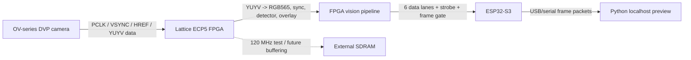

# SaturnAI Camera

**FPGA-based embedded vision camera with a custom ECP5 + ESP32-S3 PCBA, live
160x120 preview, and an FPGA-side orange-fruit detector.**

SaturnAI Camera is a custom hardware/software vision platform built around a
Lattice ECP5 FPGA, an OV-series DVP camera sensor, an ESP32-S3, and external
SDRAM. The current working path captures camera pixels on the FPGA, converts
YUYV to RGB565 in hardware, runs a small FPGA-side detector, sends a packed
parallel video stream to the ESP32-S3, and displays the result through a
localhost preview server.

Demo video: [SaturnAI Camera test video](https://youtu.be/1sOSSh_YdGI)

> [!WARNING]
> The current PCB files are **not a manufacturing release**. Rev 1.0 is the
> bring-up board and has a known PCB/design issue that will be fixed in the next
> revision. Please do **not** order the board directly from the current files. If
> you want to build one, contact me first so I can point you at the corrected
> revision or explain the required changes.

> This repository is an active hardware bring-up repo. The top-level folders now
> point to the current working design; old reference projects and generated
> simulation outputs have been moved under `archive/`.

---

## Current Status

- Custom **ECP5 FPGA + ESP32-S3 camera PCBA** designed in EasyEDA.
- Current PCB revision is a bring-up board and should **not** be ordered as-is.
- FPGA DVP camera ingest is working at true **160x120** preview resolution.
- FPGA performs **YUYV to RGB565** conversion before the ESP32 receives pixels.
- FPGA transport uses **6 data lanes + strobe + frame gate**.
- RGB565 pixels are packed into **3 symbols per pixel** over the FPGA-to-ESP32 bus.
- ESP32-S3 forwards frames over USB/serial to a Python localhost preview server.
- FPGA-side orange-fruit detector uses an **8x6 grid of 20x20 tiles**.
- Latest timing-clean detector build used about **6.9k LUT4s**, **34 EBRs**, and
  **4 MULT18s**.
- Observed performance during bring-up was roughly **6.6 fps FPGA frame gate**
  and about **2 fps end-to-end preview**, mainly limited by ESP32 software GPIO
  capture and USB/serial transfer.
- SDRAM bring-up/test infrastructure exists at **120 MHz**, but the current live
  preview path does not require SDRAM framebuffering.

---

## System Architecture


```mermaid
flowchart LR
  CAM["OV-series DVP camera"] -->|"PCLK / VSYNC / HREF / YUYV data"| FPGA["Lattice ECP5 FPGA"]
  FPGA -->|"YUYV -> RGB565, sync, detector, overlay"| PIPE["FPGA vision pipeline"]
  PIPE -->|"6 data lanes + strobe + frame gate"| ESP["ESP32-S3"]
  ESP -->|"USB/serial frame packets"| HOST["Python localhost preview"]
  FPGA -.->|"120 MHz test / future buffering"| SDRAM["External SDRAM"]
```

The split is intentional:

- **FPGA:** deterministic camera timing, pixel conversion, frame sync, detection,
  overlay, and video transport.
- **ESP32-S3:** GPIO capture bridge, USB/serial forwarding, debug/status packets,
  and future network/control tasks.
- **Host PC:** preview UI, logging, and training-data tooling.

---

## What Works Right Now

### FPGA Camera Pipeline

The active FPGA build is under:

```text
Lattice Diamond/recording/
```

Important current files:

- `fpga_top.v` - top-level camera/transport/detector design.
- `ov5640_sccb_init.v` - camera SCCB/I2C register bring-up sequence.
- `record.lpf` - Lattice pin constraints.
- `run_capture_clean_export_tasks.tcl` - Diamond build/export script.
- `model_box20_linear_plus_neg300/` - current learned tile-detector parameters.

The camera path is currently:

```text
DVP YUYV camera input
  -> FPGA byte/phase capture
  -> YUYV to RGB565 conversion
  -> 160x120 frame generation
  -> tile detector + overlay
  -> 6-lane packed GPIO transport
```

### ESP32-S3 Bridge

The active ESP-IDF firmware is under:

```text
ESP32/
```

Important current files:

- `ESP32/main/main.c` - ESP32 serial bridge and GPIO frame capture.
- `ESP32/main/wifi_profile.h.example` - local Wi-Fi profile template.
- `ESP32/main/idf_component.yml` - ESP-IDF component dependencies.

The current firmware receives the FPGA stream, packetizes frames with an
`AICAMF1` header, and sends them over USB/serial. Status packets use `AICAMS1`.

### Host Preview

The preview server is:

```text
scripts/serial_preview_server.py
```

It reads ESP32 serial packets, keeps the newest frame, and serves a live preview
at `http://127.0.0.1:8000/`.

---

## Repository Layout

```text
AiCamera/
|-- ESP32/                    ESP-IDF firmware for the ESP32-S3 bridge
|-- Lattice Diamond/recording/ Current FPGA RTL, constraints, and build scripts
|-- PCB/                      EasyEDA/Altium exports, PCB backups, datasheets
|-- Docs/                     Longer design notes and bring-up documentation
|-- scripts/                  Host preview/debug scripts
|-- sim/                      Verilator testbenches
|-- training/                 Training/model generation scripts
|-- ansys/, siwave/           SI/PI/EMI simulation project assets
|-- archive/                  Old reference projects, generated outputs, datasets
|-- README.md
|-- LICENSE
`-- .gitignore
```

### Archive Policy

The repo used to contain several temporary imported reference projects and
generated build folders at the top level. These are now grouped under:

```text
archive/legacy-code/     old reference SDRAM/HUB75/etc. code used during bring-up
archive/generated/       old Verilator outputs and waveform traces
archive/datasets/        historical captures and training data
```

The archive is kept for traceability, but new development should use the current
top-level source folders.

---

## Hardware / PCB

The PCB is a custom camera/FPGA carrier board. It is meant to put the complete
embedded-vision stack on one board instead of using loose dev modules and jumper
wires. The FPGA handles the real-time camera path, the ESP32-S3 handles host
communication/control, and the SDRAM is included for framebuffer and future
larger-pipeline work.

### Rev 1.0 Manufacturing Warning

Rev 1.0 is the board currently used for bring-up and the test video. It is
useful as proof that the architecture works, but it is **not** ready for someone
else to order unchanged.

- There is a known PCB/design issue in the current revision.
- The board files will be updated to match the bring-up fixes before this is
  treated as an orderable release.
- Do not send the current PCB files directly to fabrication/assembly unless you
  are intentionally reproducing the bring-up board.
- If you want to build one, please contact me first so I can share the latest
  status and corrected revision notes.

Known Rev 1.0 board issues are documented in
[`PCB/REV1_ERRATA.md`](PCB/REV1_ERRATA.md). In short: the bring-up boards needed
hardware repair around the FPGA power/BGA area, the microSD path is paused, the
ESP32-to-FPGA programming idea is not supported on this revision, and the ESP32
reset button path needs cleanup.

### What The PCB Includes

Main hardware blocks:

- **Lattice ECP5 FPGA** as the camera/vision datapath device.
- **ESP32-S3 module** for USB/serial, Wi-Fi-capable control, and host bridge
  firmware.
- **OV-series DVP camera connector** for the parallel camera sensor.
- **External SDRAM interface** for framebuffering and future higher-complexity
  image pipelines.
- **FPGA-to-ESP32 parallel GPIO video bus** with 6 data lanes, strobe, and frame
  gate.
- **Programming/debug access** for FPGA and ESP32 bring-up.
- Power regulation, decoupling, reset/boot support, status/debug routing, and
  board-level test access.

### What You Need To Build/Test One

This is not a polished kit yet, but a bring-up setup needs roughly:

- A fabricated/assembled SaturnAI Camera PCB/PCBA from the corrected revision.
- Lattice ECP5 FPGA matching the PCB footprint/BOM.
- ESP32-S3 module matching the PCB footprint/BOM.
- Compatible OV-series DVP camera module/sensor and matching flex/connector.
- External SDRAM part matching the PCB footprint/BOM.
- microSD card and matching socket/populated SD-card parts if you want to use
  the FPGA SD logging/write path.
- Regulators, passives, damping resistors, connectors, buttons, LEDs, and
  programming/debug headers from the board BOM.
- FTDI/FT232 or compatible FPGA programming adapter supported by
  `openFPGALoader`.
- USB cable for ESP32-S3 flashing and serial preview.
- A Windows machine with Lattice Diamond, ESP-IDF, Python, and MSYS2 tools.

Check the PCB project and BOM before buying parts. Some exact parts may change
for the next revision.

### Parts / Bring-Up Shopping Checklist

Do not treat this as a final BOM yet. It is a practical bring-up checklist for
the kind of hardware needed around the board:

| Item | Why it is needed |
| --- | --- |
| Corrected SaturnAI Camera PCB/PCBA | The custom board that connects the FPGA, ESP32-S3, camera, SDRAM, power, and debug interfaces. Do not order Rev 1.0 unchanged. |
| Lattice ECP5 FPGA | Runs deterministic camera capture, clock-domain crossing, RGB conversion, transport packing, overlay, and detector logic. |
| ESP32-S3 module | Handles USB/serial bridge firmware, Wi-Fi-capable control, debug/status reporting, and future web/control features. |
| OV-series DVP camera module | Provides the parallel PCLK/VSYNC/HREF/D[7:0] camera stream used by the FPGA. |
| Camera flex/connector/lens hardware | Needed to physically connect and focus the camera module. Exact mechanicals depend on the camera module used. |
| x16 SDRAM, such as W9825G6KH-class SDRAM | Provides external frame/line buffering capacity beyond the FPGA internal EBRs. |
| microSD card | Optional for SD logging experiments; useful if enabling the FPGA-side SD SPI writer path. |
| FTDI/FT232-style FPGA programmer | Used by `openFPGALoader` to flash/program the ECP5. |
| USB cable for ESP32-S3 | Used for ESP32 flashing, serial packets, and localhost preview. |
| Bench tools | Multimeter, soldering tools, hot air/rework if needed, and ideally an oscilloscope/logic analyzer for clocks, GPIO, and bring-up. |

### Design Rationale

| Design choice | Why it is in the design |
| --- | --- |
| **Lattice ECP5 FPGA** | The project needed real hardware video processing rather than MCU-only capture. The ECP5 gives enough LUTs, EBRs, IO, PLLs, and timing control for DVP ingest, CDC FIFOs, RGB conversion, frame packing, overlay, and small detector logic while staying cheaper and more accessible than jumping straight to a larger AMD/Xilinx device. |
| **OV-series 8-bit DVP camera instead of MIPI** | DVP is much easier to route, capture, and debug on a first FPGA camera board. PCLK, VSYNC, HREF, and D[7:0] are visible and deterministic. MIPI would require D-PHY/high-speed differential handling and a much harder FPGA receiver path. |
| **FPGA between camera and ESP32** | The ESP32 alone is not ideal for deterministic pixel capture at the target timing. The FPGA captures and cleans up pixels first, then sends the ESP32 a simpler reduced stream. |
| **External SDRAM** | FPGA internal memory is too small for full-frame buffering. SDRAM gives room for frame/line buffering, burst access, decoupling camera capture from transfer, and future higher-resolution or more complex pipelines. |
| **W9825G6KH-class x16 SDRAM** | x16 SDRAM offers useful bandwidth at lower complexity than DDR. It is a reasonable middle ground for frame buffering without making the first board much harder than necessary. |
| **Length-matched SDRAM/camera buses** | SDRAM and camera timing depend on skew between shared clock, control, address, and data nets. Matching improves timing margin and makes high-speed bring-up less random. |
| **ESP32-S3** | The FPGA handles real-time pixels; the ESP32 handles system glue: USB/serial, Wi-Fi-capable control, web/preview work, debugging, and future higher-level processing. |
| **Custom parallel FPGA-to-ESP32 video link** | UART/SPI-only transfer was too limiting for live preview. A parallel lane bus with strobe and frame gate gives the FPGA simple timing and gives the ESP32 more throughput than a basic serial control link. |
| **UART/control path** | UART remains useful for low-speed reliable control, mode changes, telemetry, debug prints, and bring-up even when the video bus is doing frame transfer. |
| **SCCB/I2C camera configuration** | OV sensors require register setup for resolution, pixel format, timing, JPEG/YUYV/RGB modes, and bring-up tuning. |
| **24 MHz camera clock** | The camera needs a stable external XCLK/MCLK. Providing a known clock makes the camera timing predictable and gives the FPGA design a stable capture target. |
| **CDC FIFOs / cross-clock handling** | Camera PCLK, FPGA system clock, SDRAM clock, and ESP32 transfer timing are different domains. CDC logic prevents metastability and frame corruption. |
| **YUYV/RGB565 bring-up path** | Raw color formats are easier to debug visually than jumping straight to JPEG or AI. They make frame sync, byte phase, color conversion, overlays, and transport bugs visible. |
| **JPEG experiments** | JPEG can reduce bandwidth dramatically for future streaming modes, but raw/YUYV/RGB565 was the better first path for bring-up and debugging. |
| **Tile/ROI FPGA acceleration** | The FPGA can cheaply compute tile features, motion/ROI masks, crops, and overlays in parallel before the ESP32 sees the frame. This reduces software load and makes the project closer to real edge-AI hardware. |
| **Series resistor footprints near drivers** | Optional 22-33 ohm damping gives bring-up flexibility for PCLK, camera data, SDRAM, and FPGA-to-ESP32 lines. Placing them near the driver helps control edge-rate/reflection behavior. |
| **Continuous ground/return-path control** | PCLK, SDRAM clock, DVP, and the FPGA-to-ESP32 bus need clean return paths. Poor return paths cause ringing, EMI, crosstalk, and timing bugs. |
| **Via stitching / fencing** | Stitching improves return-path continuity and helps contain fields around noisy/high-activity regions. This tied directly into the SIwave near-field improvements. |
| **Separate 1.1 V / 1.8 V / 3.3 V rails** | FPGA core, camera analog/IO, SDRAM/IO, and ESP32-side logic do not all run from one voltage. Separate rails and local decoupling are required for a stable board. |
| **Local decoupling around FPGA, SDRAM, camera, and ESP32** | Fast digital switching creates short current bursts. Local capacitors reduce rail droop and help keep the FPGA core, IO banks, SDRAM, and camera analog supplies stable. |
| **SIwave / IBIS / PDN simulation** | The board was checked as an electrical system, not just a routed PCB. Simulation work covered DC-IR, PDN behavior, near-field EMI, return paths, and high-speed interface integrity. |
| **JLCPCB-friendly design choices** | The board was designed to be manufacturable and affordable, with realistic parts/processes rather than an idealized board that would be hard to assemble or debug. |
| **JTAG, UART, test points, and debug access** | First revisions fail in interesting ways. Programming/debug access makes it possible to isolate whether an issue is FPGA logic, camera timing, SDRAM, ESP32 firmware, power, or routing. |
| **4-layer vs. higher-layer stackup tradeoff** | More layers make return paths, EMI, and PDN design easier. Fewer layers reduce cost and assembly friction. The project keeps that tradeoff explicit because the next revision may adjust the stackup around the SI/PI lessons from Rev 1.0. |

Short version: SaturnAI uses the ECP5 for deterministic pixel capture and
hardware preprocessing, DVP because it is FPGA-friendly and observable, SDRAM
because internal FPGA memory is too small for full frames, and the ESP32-S3 for
host control, serial/web preview, and system glue. The PCB was designed around
debuggability first: length matching, return-path control, damping footprints,
separate rails, test access, and simulation-backed SI/PI/EMI iteration.

### What Has Been Tested On Rev 1.0

- FPGA can be built and flashed through the Lattice/openFPGALoader flow.
- ESP32-S3 firmware can be built/flashed with ESP-IDF.
- Camera DVP capture path works well enough for true **160x120** live preview.
- FPGA-side **YUYV to RGB565** conversion is active.
- FPGA-to-ESP32 6-lane packed GPIO video transport works for live preview.
- ESP32-S3 can forward frames over USB/serial to the localhost preview server.
- FPGA-side tile detector can draw orange-fruit detection boxes in hardware.
- SDRAM 120 MHz test infrastructure exists, but full SDRAM framebuffer use is
  still part of bring-up/future work.

### PCB/SI/PI Work

Board-level design work included:

- FPGA bank power and IO planning.
- Camera, SDRAM, and ESP32 connector routing.
- Return-path planning and power-plane cleanup.
- Length matching where needed.
- 33 ohm series damping resistors on high-activity lines.
- Ansys SIwave/IBIS-based SI/PI/EMI review.

Earlier SIwave iterations reduced simulated near-field peaks from roughly
**15 kV/m to under 350 V/m** E-field and roughly **1000 A/m to under 7 A/m**
H-field through return-path cleanup, routing changes, damping, and power-plane
refinement.

---

## Software Requirements

### Required

- Windows 10/11
- Git
- Python 3.11 or newer
- `pyserial` for the host preview server
- ESP-IDF 5.5.x for ESP32-S3 firmware
- Lattice Diamond 3.14 for FPGA builds
- MSYS2 + `openFPGALoader` for FPGA programming

### Optional

- Verilator for RTL simulation
- Ansys SIwave for SI/PI/EMI project work

---

## Quick Start

### 1. Clone

```powershell
git clone https://github.com/regular030/AiCamera.git
cd AiCamera
```

### 2. Install Python Dependencies

```powershell
python -m pip install pyserial
```

### 3. Build and Flash the FPGA

Update paths if your Diamond/MSYS2 install is in a different location.

```powershell
& 'C:\lscc\diamond\3.14\bin\nt64\pnmainc.exe' `
  'C:\Users\User\Desktop\AiCamera\Lattice Diamond\recording\run_capture_clean_export_tasks.tcl'

& 'C:\msys64\ucrt64\bin\openFPGALoader.exe' `
  -c ft232 `
  'C:\Users\User\Desktop\AiCamera\Lattice Diamond\recording\_capture_clean_build\impl1\capclean_impl1.bit'
```

Known-good local bitstream path from the current workflow:

```text
Lattice Diamond/recording/_capture_clean_build/impl1/capclean_impl1.bit
```

### 4. Configure ESP32 Local Wi-Fi/Profile

If your firmware build expects a local profile, copy the example:

```powershell
Copy-Item ESP32\main\wifi_profile.h.example ESP32\main\wifi_profile.h
```

Then edit `ESP32/main/wifi_profile.h` for your local setup. This file is ignored
because it can contain private credentials.

### 5. Build and Flash the ESP32-S3

On this machine the working ESP-IDF Python environment is:

```text
C:\Users\User\.espressif\python_env\idf5.5_py3.11_env
```

Example PowerShell/cmd flow:

```powershell
$env:IDF_PYTHON_ENV_PATH = 'C:\Users\User\.espressif\python_env\idf5.5_py3.11_env'
cmd /c "C:\Users\User\esp\v5.5.1\export.bat && cd /d C:\Users\User\Desktop\AiCamera\ESP32 && idf.py -p COM3 build flash monitor"
```

Use the correct serial port for your board. During bring-up this board used
`COM3`.

### 6. Start the Local Preview

In another terminal:

```powershell
python scripts\serial_preview_server.py --port auto --baud 2000000 --http-port 8000
```

Open:

```text
http://127.0.0.1:8000/
```

---

## Frame Packet Format

The ESP32 sends frame packets with a 32-byte little-endian header:

```text
magic[8]       = "AICAMF1\0"
u16 width      = 160
u16 height     = 120
u16 format     = 0x0565 RGB565, 0x0444 RGB444 packed, or 0x0332 RGB332 packed
u16 header_len = 32
u32 frame_id
u32 payload_len
u32 capture_us
u32 gate_period_us
```

Status packets use:

```text
magic[8] = "AICAMS1\0"
```

The Python preview server handles RGB565, packed RGB444, and packed RGB332
payloads and converts them into a canvas preview.

---

## FPGA Detection Model

The current hardware detector is intentionally small enough to fit on the ECP5
while running inline with the frame pipeline.

Current detector shape:

- 160x120 frame
- 8x6 grid of 20x20 tiles
- RGB/orange feature accumulation per tile
- learned tile scoring
- neighborhood/grid filtering to reduce isolated false positives
- detection boxes drawn directly in FPGA hardware

This is not a full desktop-class CNN. It is a hardware-friendly detector built
for a small FPGA and live camera bring-up.

---

## SDRAM Notes

The board includes external SDRAM and a 120 MHz SDRAM test path. Current notes:

- 120 MHz SDRAM clock/test infrastructure exists.
- Address/data/control package-pin activity has been checked during bring-up.
- Full 16-bit SDRAM framebuffer use is still a bring-up target, not the required
  path for the current live preview.
- See `Lattice Diamond/recording/SDRAM_STRESS_TEST.md` for the latest SDRAM
  stress-test notes.

---

## Development Notes

- Keep generated build output out of commits.
- Keep private Wi-Fi credentials in `ESP32/main/wifi_profile.h`, not in Git.
- Use `archive/` for old experiments that are useful for reference but not part
  of the active design.
- If you add a new top-level tool or workflow, document it here or under `Docs/`.

---

## License

See `LICENSE`.
